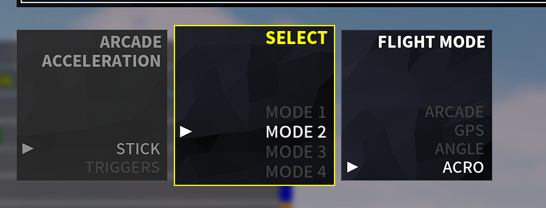

DJI RC-N1
===============
 - Connect your DJI Remote Controller to your PC and use it to play simulators
 - Confirmed DJI Mavic 3 RC231
 - For Mavic Mini or a Python interface, take a look at [justin97530/miniDjiController](https://github.com/justin97530/miniDjiController)
 - For DJI Mini 2 or a Python interface, take a look at [usatenko/DjiMini2RCasJoystick](https://github.com/usatenko/DjiMini2RCasJoystick)
 - For DJI Phantom 3 take a look at [mishavoloshchuk/mDjiController](https://github.com/mishavoloshchuk/mDjiController)
 - Produced by fixing a project that does not work - Original version (https://github.com/IvanYaky/DJI_RC-N1_SIMULATOR_FLY_DCL)
-----------------------------------------------------------------------------

This is a program that connects to your DJI Mavic 3 Remote Controller (RC-N1) as a XBox360 gamepad,
reads the stick positions and tells Windows that position.

-----------------------------------------------------------------------------

설치가이드
- 1. 파이썬 설치
  2. 파이썬 패키지 설치
     CMD 실행 후 -> pip3 install vgamepd 입력 후 엔터
     pip3 install pyserial 입력 후 엔터
  3. RC-N1 전원 켜기
  4. C타입(아랫구멍)으로 컴퓨터와 연결
  5. main.py 실행 (우클릭 후 파이썬 선택)
  6. 시뮬레이션 실행
  % 만약 실행이 안될 시 RC N1 제외 한 모든 USB 제거(키보드 마우스 제외)%

Installation / Usage
- Install packages before usage:
- pip3 install vgamepad
- pip3 install pyserial

- Power on RC-N1
- Connect via bottom type-C
- run main.py
- run yor simulator
% If it does not run, remove all USB except RC N1 (except keyboard and mouse)%

for restart game or recover drone: use camera wheel, left scroll
게임 재시작 버튼은 카메라 휠을 돌리면 재시작됩니다

TROUBLESHOOTING
-----------------------------------------------------------------------------
App searching by itself for the serial port with description "DJI USB VCOM For Protocol"
make sure your device attached via bottom Type-C connector

[Tested with DCL - The game](https://store.steampowered.com/app/964570/DCL__The_Game/) 

    Preset:
    Mode 2
    Acro
    Zero throttle at stick center

